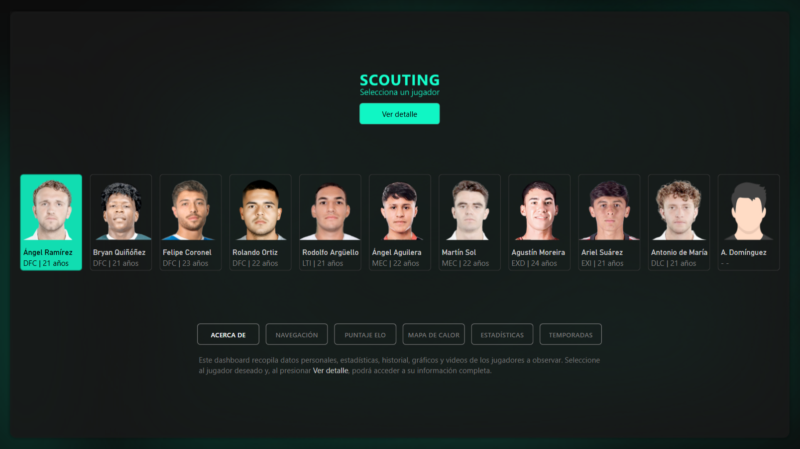
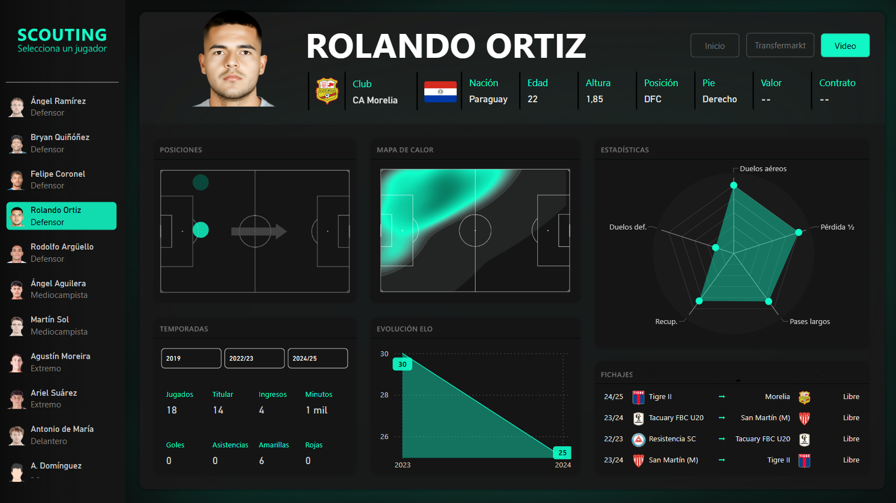
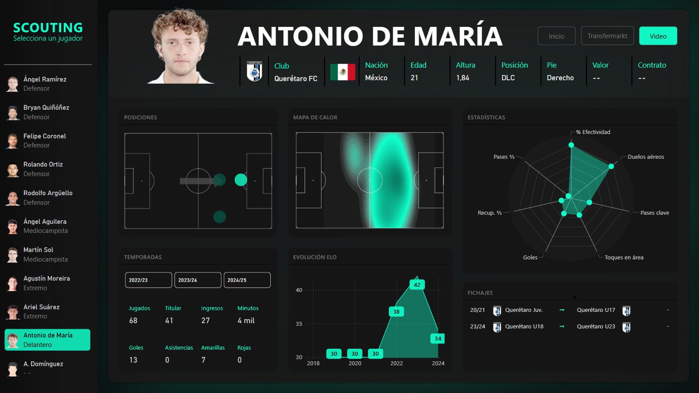

# Scouting Resources  
Resources for dashboards and reports on football scouting.

  

## Overview  
**Scouting Resources** is a repository that provides assets and scripts for creating football scouting dashboards and reports. This includes visual elements such as backgrounds, heatmaps, logos, and player images, as well as a Python notebook for generating heatmaps based on event data.  

## Contents  
- **Assets**:  
  - Backgrounds for dashboards.  
  - Logos and player photos for visual enhancements.  
  - Heatmaps for player analysis.  

- **Screenshots**:  
  Examples of the dashboard created with Power BI using these resources:  
  -   
  - 
